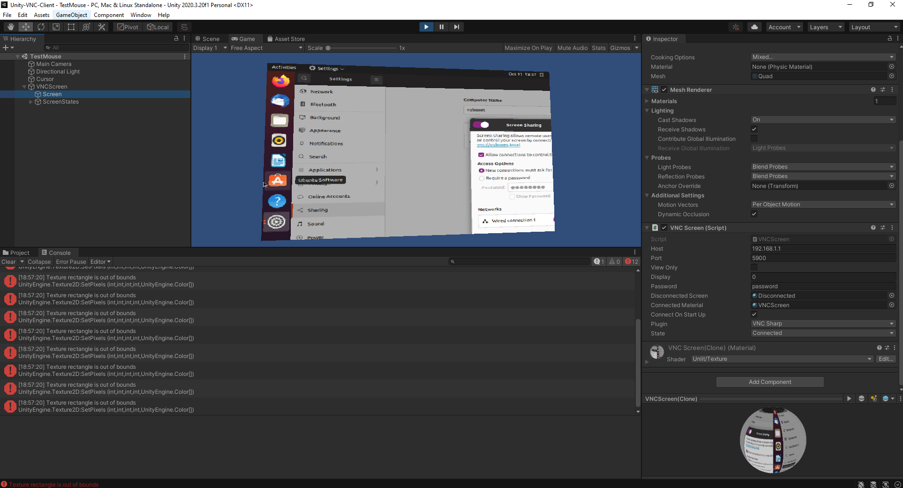

# Unity-VNC-Client

- [Description](#description)
- [Developer Notes](#developer-notes)
- [Testing](#testing)

## Description
Unity 3D Vnc Client : Port of the VncSharp: A .NET VNC Client Library 
to Unity 3D

## Developer Notes
There is still some trouble with keys but as my main purpose is to integrate it into vr (without keyboard), I've let this buggy section as it.
The original code has been simplified because there is only one mode of view (no scaling or clipped).
All the GDI+ stuff has been removed and replaced by unity ones (Texture2D for bitmap, raycasting for mouse input...)

# Testing
Tested using Unity 2020.3.20f1 LTS under windows.

Use the TestMouse scene to have a try.
I've tested using tightVNC client under windows.  

  
For more detailed testing documentation please read [testing](./docs/testing.md).

 

