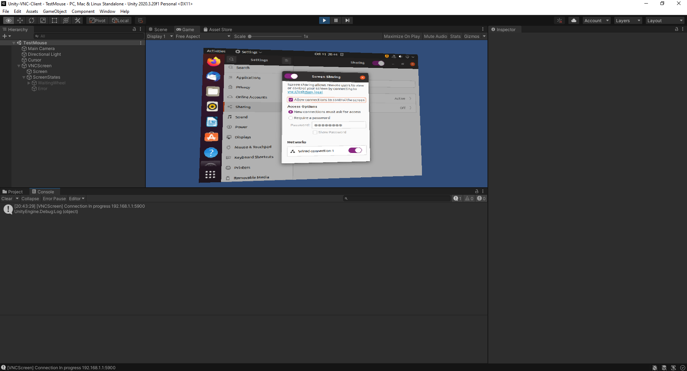

# Testing  
- [Description](#description)
- [Environment](#environment)  

## Description
Using this document you will be able to successfully test the Unity project.  

## Environment
|Name|Description|  
|---|---|  
|Host Operating System|Windows 10 Version 20H2 (OS Build 19042.1237) |  
|Guest Operating System|Ubuntu 21.04|  
|Virtual Box |Version 6.1.18 r142142 (Qt5.6.2)|  
|Unity|Version 2020.3.20f1|  
|||  
|||  

- Virtual Box: If you have another computer running a vnc server this step can be skipped.  Install Virtual Box, this document uses the version referenced in the above table, but any version can be used.  
- Guest VM: Download virtual box hard drive from osboxes.org.  This document uses the guest OS referenced in the above table, but any OS running a vnc server can be used.  https://sourceforge.net/projects/osboxes/files/v/vb/55-U-u/21.04/64bit.7z/download
   - Unzip downloaded file.  
   - Create new virtual machine using virtual box and associate the downloaded *.vdi with the new virtual machine.  https://www.virtualbox.org/manual/ch05.html  
   - Log into virtual machine.
   - Enable remote desktop with default project parameters.  
   - 
   - This step is not necessary, but useful for troubleshooting.  Install tightVNC on Host OS and connect to Guest VNC server.  
- Unity: Install Unity.  This document uses the version referenced in the above table.  

## Test
- Open project in Unity.
- Load `TestMouse` scene.  
- Verify default project connection information is correct.  Change information as needed.  
- Play project.
- Verify connection.  
- Note: The password had to be removed, because the authentication was not working properly.  
- 
- Verify operation by moving windows on guest vm in Unity.  
- 
